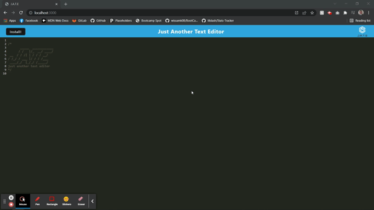

# Textitor-1000
  

## Description

This project is a practice in PWA application. This text editor will accept and color javascript text and save it using and  indexedDB. This text editor can also be installed onto the user's local device.

## Table of Contents
* [Installation](#installation)
* [Usage](#usage)
* [License](#license)
* [Contributing](#contributing)
* [Questions](#questions)
   

## Installation

Click the install button.

## Usage

Open the application and type in the desired javascript text. The application will automatically save the text on screen when the application loses focus. Click on the install button on the top right of the screen to install.

## License

This project is licensed under the MIT license.
https://opensource.org/licenses/MIT

## Contributing

Open Source

## Questions

Github Username: bslindsa 

Email: bslindsa@gmail.com

